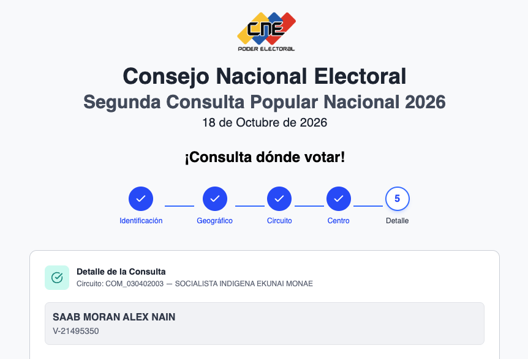

# Alex Saab y Camila Fabri aparecen en el registro electoral del CNE

El **8 de octubre de 2026** consulté en la página oficial del CNE para la consulta popular
([consultapopular.cne.gob.ve](https://consultapopular.cne.gob.ve)) dos cédulas venezolanas.
**Las dos aparecen inscritas en el Registro Electoral Permanente.**

| Cédula | Persona |
|---|---|
| V-21.495.350 | Alex Saab |
| V-36.893.134 | Camila Fabri |

Este repositorio guarda esa consulta tal como la respondió el CNE, con pruebas de la fecha,
por si después los registros desaparecen.

## Lo que muestra la página del CNE

**Alex Saab (V-21.495.350):**



La consulta de Camila Fabri está en [capturas-pantalla/camila-fabri.png](capturas-pantalla/camila-fabri.png).

## ¿Por qué importa?

Diosdado Cabello, secretario general del PSUV, dijo públicamente que Alex Saab no es venezolano y
que su cédula no era legal. Así lo publicó la página oficial del PSUV:

> «Alex Saab no es venezolano, es un ciudadano de origen colombiano, quien siempre presentaba una
> cédula de identidad que no era legal, sin ningún tipo de sustento dentro del Saime»
>
> — Diosdado Cabello, en [psuv.org.ve](http://www.psuv.org.ve/temas/noticias/%E2%80%8Bautoridades-confirman-deportacion-ciudadano-alex-saab/)
> ([copia en archive.org](https://web.archive.org/web/20261008092601/http://www.psuv.org.ve/temas/noticias/%E2%80%8Bautoridades-confirman-deportacion-ciudadano-alex-saab/))

En el mismo artículo, las autoridades afirman que Saab *«no cumplía ni cumple con ninguno de los
requisitos legales exigidos por el SAIME para ser considerado ciudadano venezolano»*.

**Aun así, esa misma cédula aparecía el 8 de octubre de 2026 en el registro electoral del CNE para esta consulta popular.**

También guardé una copia del artículo en [`fuentes/`](fuentes/), sellada con OpenTimestamps
igual que las capturas, por si lo borran de la web del PSUV y de archive.org.

## ¿Cómo sé que esto no es un montaje?

Una captura de pantalla se puede editar. Por eso, además de las imágenes, guardé la
**respuesta original del servidor del CNE** y la sellé para demostrar cuándo se obtuvo:

1. **La respuesta original.** Es el archivo que envió el servidor del CNE, sin tocar. Viene con
   la fecha que marcó el propio servidor y con el certificado de seguridad de la página, que
   confirma que la respuesta salió de `consultapopular.cne.gob.ve`.
2. **Una huella digital de cada archivo.** Es un código único que se calcula a partir del
   contenido. Si alguien cambia una sola letra del archivo, la huella cambia por completo.
3. **Un sello de fecha público.** Las huellas se registraron con
   [OpenTimestamps](https://opentimestamps.org) en la blockchain de Bitcoin, un registro público
   que nadie puede alterar. Eso prueba que los archivos ya existían el 8 de octubre de 2026 y que
   no se han modificado desde entonces.

Todo está en [`capturas/20261008T091337Z/`](capturas/20261008T091337Z/). La carpeta se llama
así por la hora de la consulta en UTC (09:13, que en Venezuela eran las 05:13).

**Cualquiera puede comprobarlo por su cuenta:** mete tu cédula y la de ellos en
[consultapopular.cne.gob.ve](https://consultapopular.cne.gob.ve) y mira qué responde.

---

## Detalles técnicos

Cada carpeta en `capturas/<fecha UTC>/` contiene:

- `V<cedula>.json`: respuesta del endpoint `POST /circuits-re-api/api/get-register`, sin modificar
- `V<cedula>.headers`: cabeceras HTTP de la respuesta (incluye `Date` del servidor)
- `V<cedula>.curl-trace.txt`: traza de curl con la petición enviada, el handshake TLS y los tiempos
- `token.json` / `token.headers`: token de sesión emitido por `/circuits-re-api/api/token`
- `tls-cadena.pem.txt` / `tls-resumen.txt`: cadena de certificados que presentó el servidor
- `SHA256SUMS` + `SHA256SUMS.ots`: hashes SHA-256 de todo lo anterior y su prueba OpenTimestamps

Para verificar:

```sh
pipx install opentimestamps-client
cd capturas/20261008T091337Z
shasum -a 256 -c SHA256SUMS      # los archivos no cambiaron
ots verify SHA256SUMS.ots        # existían en la fecha del sello
```

Para repetir la captura: `./capturar.sh [cedula ...]` (sin argumentos usa las dos cédulas de arriba).
